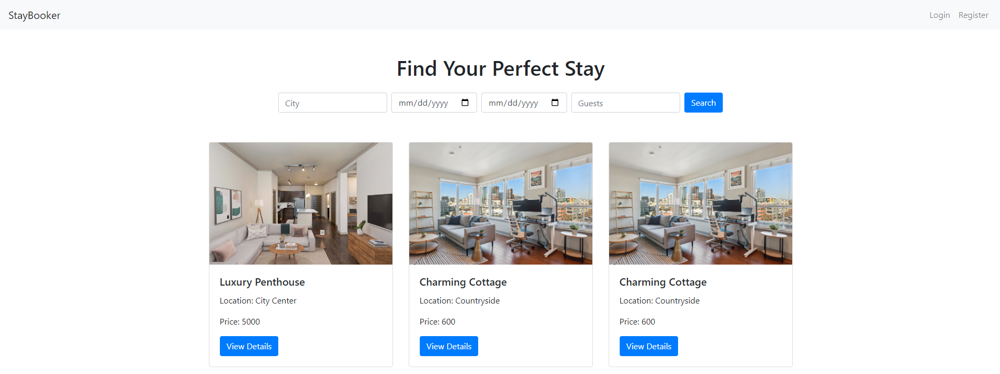

# Staybooker

Staybooker - система онлайн бронирования жилья, которая позволяет пользователям искать доступные варианты жилья,  
просматривать их характеристики и бронировать апартаменты на определенные даты.  

Доступный функционал:
- Регистрация и аутентификация пользователя
  - Пользователи могут зарегистрироваться и войти в систему с помощью email и пароля.
  - Администратор может управлять пользователями и их правами.
- Поиск и фильтрация жилья 
  - Пользователи могут искать жилье по различным критериям: город, дата заезда и выезда, количество гостей, цена и т.д.
  - Результаты поиска отображаются в виде списка с кратким описанием каждого варианта.
- Просмотр информации о жилье
  - Для каждого варианта жилья доступна подробная информация: фотографии, описание, расположение на карте, удобства, отзывы других пользователей и т.д.
  - Возможность просмотреть календарь доступности жилья.
- Система бронирования
  - Пользователь может выбрать доступные даты и забронировать жилье.
  - Система проверяет доступность и сохраняет информацию о бронировании в базе данных.
  - Уведомление пользователя по email о подтверждении бронирования.
- Управление бронированиями
  - Пользователь может просматривать свои текущие и прошлые бронирования.
- Административная панель
  - Администратор может добавлять, изменять или удалять информацию о жилье

Используемые технологии:
- Java 17
- Lombok 1.18.34
- Apache Maven 3.9.5 
- Hibernate 6.5.2.Final 
- PostgreSQL 12.19 (Docker)
- Liquibase 4.28
- Apache Tomcat 10.1.28 (Docker)
- Jakarta EE 10
  - Jakarta Servlets
  - Jakarta Server Pages
  - Jakarta Standard Tag Libs